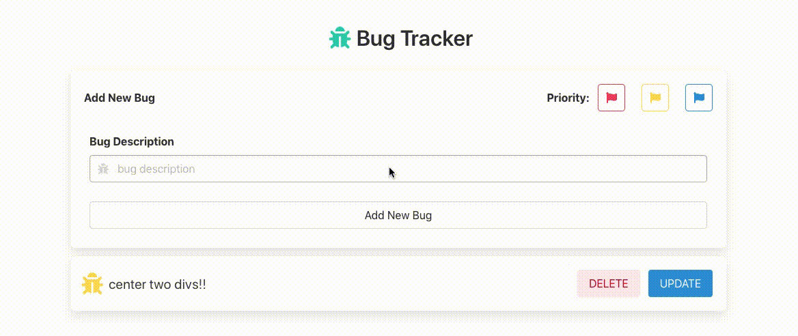
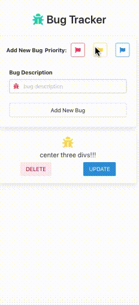

# Bug Tracker
> built a bug tracker using React, Django, and Postgres.

## Table of Contents
* [Technologies Used](#technologies-used)
* [Features](#features)
* [Screenshots](#screenshots)
* [Project Status](#project-status)
* [Contact](#contact)
<!-- * [License](#license) -->

## Technologies Used
- Django - version 4.0.3
- Django Rest Framework - version 3.11
- Reactjs - version 17.0.2
- Postgres - version 14.2

## Features
- post new bug
- delete existing bug
- update existing bug
- set priority of bug

## Screenshots

## Project Status
Project is: _complete_

## Contact
Created by [@SergioHPassos](https://www.linkedin.com/in/sergio-passos-809aa114a/) - feel free to contact me!
